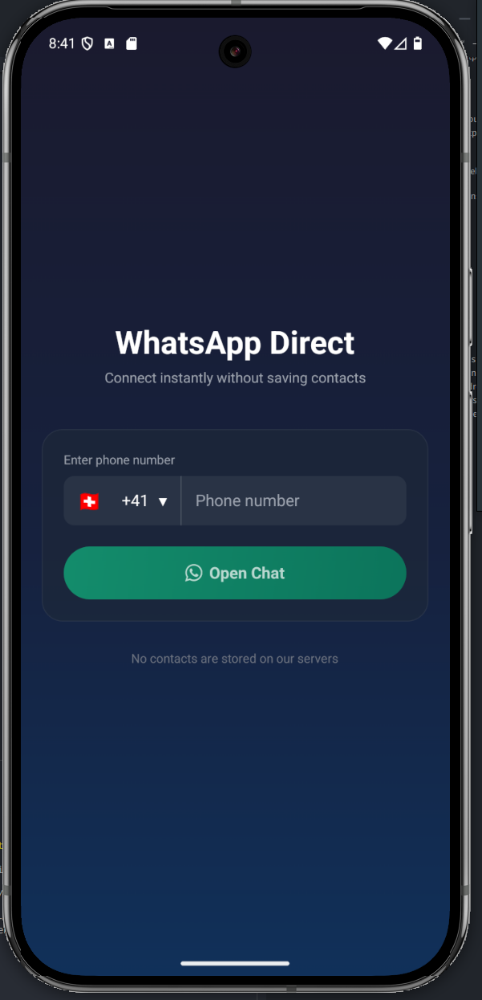

# WhatsAppGo



A simple React Native app built with Expo, TypeScript, and NativeWind that lets users quickly start a WhatsApp chat with any phone number.

## Features

- Enter a phone number and open a WhatsApp chat instantly
- Modern UI with Tailwind CSS (NativeWind)
- TypeScript for type safety
- Compatible with Android, iOS, and Web

## Getting Started

### Prerequisites

- [Node.js](https://nodejs.org/) (18+ recommended)
- [Yarn](https://yarnpkg.com/) (v4+ recommended)
- [Expo CLI](https://docs.expo.dev/get-started/installation/)

### Installation

1. Clone the repository:

   ```sh
   git clone <your-repo-url>
   cd whatsapp-link-go
   ```

2. Install dependencies:

   ```sh
   yarn install
   ```

## Scripts

- **yarn start**

  Runs the Expo development server for local development and testing.

  ```sh
  yarn start
  ```

- **yarn android**

  Starts the Expo development server and opens the app on a connected Android device or emulator.

  ```sh
  yarn android
  ```

- **yarn ios**

  Starts the Expo development server and opens the app on a connected iOS device or simulator (macOS only).

  ```sh
  yarn ios
  ```

- **yarn prebuild**

  Generates native iOS and Android project files from your Expo app config.

  ```sh
  yarn prebuild
  ```

- **yarn lint**

  Runs ESLint and Prettier in check mode to find code style and formatting issues.

  ```sh
  yarn lint
  ```

- **yarn format**

  Automatically fixes lint and formatting issues using ESLint and Prettier.

  ```sh
  yarn format
  ```

- **yarn build:android**

  Builds the Android app locally using EAS (Expo Application Services).

  ```sh
  yarn build:android
  ```

- **yarn build:ios**

  Builds the iOS app locally using EAS (Expo Application Services).

  ```sh
  yarn build:ios
  ```

- **yarn build:android:release**

  Builds the Android app for release using EAS (Expo Application Services) in the cloud.

  ```sh
  yarn build:android:release
  ```

- **yarn build:ios:release**

  Builds the iOS app for release using EAS (Expo Application Services) in the cloud.

  ```sh
  yarn build:ios:release
  ```

## Usage

1. Enter a phone number in the input field (with country code, e.g. `15551234567`).
2. Tap "Open Chat" to open WhatsApp and begin a chat with that number.

## Tech Stack

- [Expo](https://expo.dev/)
- [React Native](https://reactnative.dev/)
- [Expo Router](https://expo.github.io/router/)
- [NativeWind (Tailwind CSS for React Native)](https://www.nativewind.dev/)
- [TypeScript](https://www.typescriptlang.org/)

## Troubleshooting

- If you encounter dependency errors with Expo and Yarn PnP, ensure all required Metro packages are installed and consider using `nodeLinker: node-modules` in `.yarnrc.yml` for best compatibility.
- For more help, see the [Expo documentation](https://docs.expo.dev/).

### Generating a Local Android Keystore

To build a signed Android APK locally, you need a keystore file. You can generate one using the following steps:

1. Create a directory for your keystore (if it doesn't exist):

   ```sh
   mkdir -p ~/.android/key
   cd ~/.android/key
   ```

2. Generate the keystore using `keytool`:

   ```sh
   keytool -genkeypair -v -keystore android-generated.keystore -alias android-key-alias -keyalg RSA -keysize 2048 -validity 10000
   ```

- This will prompt you for a password and some information. Remember your password and alias (`android-key-alias`), as you'll need them for signing your app.
- The generated file (`android-generated.keystore`) will be used for local Android builds (see the build scripts section above).

### Java Setup for Android Builds

If Java is not installed, Android Studio comes bundled with a compatible version. You can link the bundled Java binary and set your `JAVA_HOME` as follows:

1. Link the bundled Java binary (adjust the path if your Android Studio is installed elsewhere):

   ```sh
   sudo ln -s /android-studio/jbr/bin/java /local/bin/java
   ```

2. Ensure your `JAVA_HOME` environment variable is set correctly. Add the following to your shell configuration file (e.g., `~/.zshrc`, `~/.bashrc`, etc.):

   ```sh
   export JAVA_HOME="/opt/android-studio/jbr/bin/java"
   ```

   Then reload your shell configuration:

   ```sh
   source ~/.zshrc  # or source ~/.bashrc
   ```

### Building and Installing Android App Bundles (AAB)

You can use [Bundletool](https://developer.android.com/studio/command-line/bundletool) to build and install AAB files for your Android app:

#### Build AAB for Connected Device (smaller size bundle)

```sh
java -jar ~/Downloads/bundletool-all-1.18.1.jar build-apks --bundle=./build-xxxxx.aab --output=output.apks --connected-device
```

#### Build Universal AAB (single APK for all devices)

```sh
java -jar ~/Downloads/bundletool-all-1.18.1.jar build-apks --bundle=./build-xxxxx.aab --output=output.apks --mode=universal
```

#### Install the Built AAB to Connected Device

```sh
java -jar ~/Downloads/bundletool-all-1.18.1.jar install-apks --apks=./output.apks
```

- Replace the bundle file name as appropriate for your build.
- For more details, see the [Bundletool documentation](https://developer.android.com/studio/command-line/bundletool).

## License

MIT
